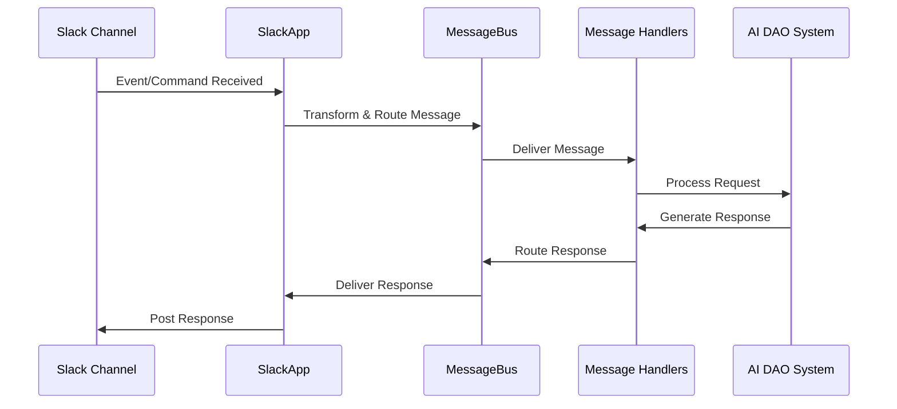

# Slack Integration Message Flow Diagram

```mermaid
sequenceDiagram
    participant Slack as Slack Channel
    participant SlackApp as SlackApp
    participant MessageBus as MessageBus
    participant Handlers as Message Handlers
    participant System as AI DAO System

    Slack->>SlackApp: Event/Command Received
    SlackApp->>MessageBus: Transform & Route Message
    MessageBus->>Handlers: Deliver Message
    Handlers->>System: Process Request
    System->>Handlers: Generate Response
    Handlers->>MessageBus: Route Response
    MessageBus->>SlackApp: Deliver Response
    SlackApp->>Slack: Post Response
```

## Diagram Explanation
1. **Slack Channel**: Where users interact with the bot
2. **SlackApp**: Rece
